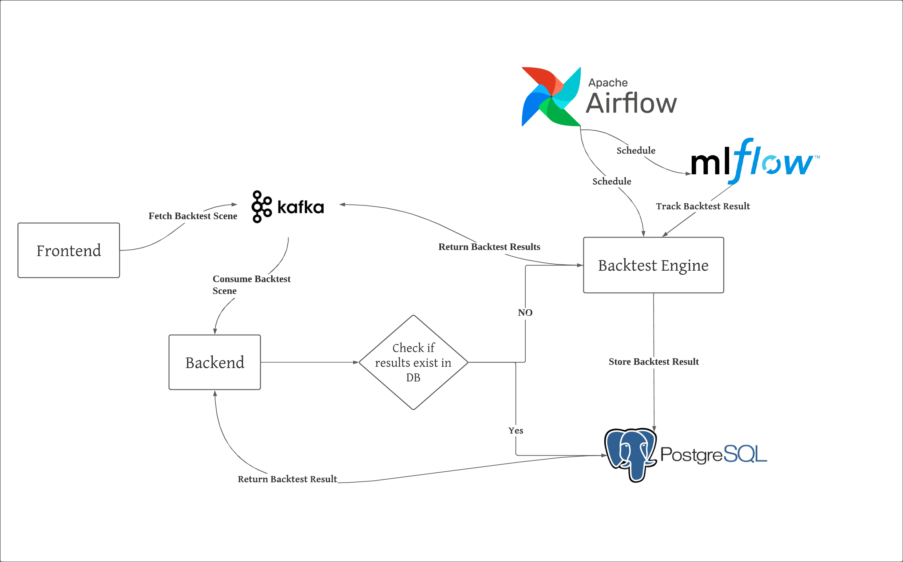

# Scalable-Backtesting-Infrastructure-

<h1 align="center">Algorithmic Trading: Automated Scalable Backtesting Infrastructure</h1>
<div>
<a href="https://github.com/10AcademyB6Week7/Scalable-Backtesting-Infrastructure/network/members"></a>
<a href="https://github.com/10AcademyB6Week7/Scalable-Backtesting-Infrastructure/pulls"></a>
<a href="https://github.com/10AcademyB6Week7/Scalable-Backtesting-Infrastructure/issues"></a>
<a href="https://github.com/10AcademyB6Week7/Scalable-Backtesting-Infrastructure/graphs/contributors"></a>
<a href="https://github.com/10AcademyB6Week7/Scalable-Backtesting-Infrastructure/blob/main/LICENSE"></a>
</div>


</br>



<br />
<p align="center">
  <h3 align="center">Algorithmic Trading: Automated Scalable Backtesting Infrastructure</h3>

  <p align="center">
  <ul>
    <li>
    <b>Algorithmic Trading</b> is an application of Technical Analysis tools, such as <b>Backtesting</b> to evaluate investments by analyzing statistical trends gathered from trading activity, such as price movement and volume.
    </li>
    <li>
    <b>Backtesting</b> is accomplished by reconstructing, with historical data, trades that would have occurred in the past using rules defined by a given strategy. The result offers statistics to gauge the effectiveness of the strategy.
    </li>
  </ul>
    <br />
    <a href="https://www.investopedia.com/articles/trading/05/030205.asp"><strong>Read More »</strong></a>
    <br />
    <br />
  </p>
</p>


## Table of Contents

* [Data Engineering: text to speech data collection](#Data-Engineering)

  - [Project Structure](#project-structure)
    * [images](#images)
    * [notebooks](#notebooks)
    * [scripts](#scripts)
    * [frontend](#frontend)
    * [backend](#backend)
    * [root folder](#root-folder)
  - [Installation guide](#installation-guide)
  - [Getting Started](#getting-started)
    * [Prerequests](*prerequests)
    * [Installations](*installations)
  - [License](#license)
  - [Contributors](#contributors)


## Project Structure

### images:

- `images/` the folder where all snapshot for the project are stored.

### notebooks:

- `notebooks/` the folder which contains code snippets for algorand sdk

### scripts:

- `.scripts/`: the folder where the python implementation can be found.

### frontend:

- `frontend/`: the folder where the frontend implementation of the application can be found.

### backend:

- `backend/`: the folder where the backend implementation of the application can be found.

### .github:

- `.github/`: the folder where github actions and CML workflow is integrated.


### root folder

- `requirements.txt`: a text file lsiting the projet's dependancies.
- `setup.py`: a configuration file for installing the scripts as a package.
- `README.md`: Markdown text with a brief explanation of the project and the repository structure.


## Installation guide

```bash
git clone https://github.com/10AcademyB6Week7/Scalable-Backtesting-Infrastructure.git
cd Scalable-Backtesting-Infrastructure
pip install -r requirements.txt
python3 backend/app.py
```


## Frontend usage guide
```bash
git clone https://github.com/10AcademyB6Week7/Scalable-Backtesting-Infrastructure-Frontend.git
cd Scalable-Backtesting-Infrastructure-Frontend
npm install --legacy-peer-deps
npm start
```


<!-- GETTING STARTED -->
## Getting Started

## Articles
- [Medium Article](https://medium.com/)

### Prerequisites

Make sure you have the following components installed on your local machine.

  
### Installation

1. Clone the repo
```bash
git clone https://github.com/10AcademyB6Week7/Scalable-Backtesting-Infrastructure.git
   ```
 Run
   ```bash
    sudo python3 setup.py install
   ```


<!-- LICENSE -->
## License

Distributed under the MIT License. See `LICENSE` for more information.


<!-- CONTACT -->
## Contributors
<a href = "https://github.com/10AcademyB6Week7/Scalable-Backtesting-Infrastructure/graphs/contributors">
  
</a>

👤 **Natnael Melese**

- GitHub: [Natnael Melese](https://github.com/natyrix)
- LinkedIn: [Natnael Melese](https://www.linkedin.com/in/natnael-melesse-298879196/)

👤 **Yishak Tadele**

- GitHub: [Yishak Tadele](https://github.com/isaaclucky)
- LinkedIn: [Yishak Tadele](https://www.linkedin.com/in/yishak-tadele/)

👤 **Henok Desalegn**

- GitHub: [Henok Desalegn](https://github.com/henokd11)
- LinkedIn: [Henok Desalegn](https://www.linkedin.com/in/henok-desalegn/)

👤 **Gedion Abebe**

- GitHub: [Gedion Abebe](https://github.com/gedionabebe)
- LinkedIn: [Gedion Abebe](https://www.linkedin.com/in/gedion-abebe-489a65152/)


👤 **Bekalu Tadele**

- GitHub: [Bekalu Tadele](https://github.com/BekaluTa)
- LinkedIn: [Bekalu Tadele](https://www.linkedin.com/in/bekalu-tadele)

👤 **Adijat Ojutomori**

- GitHub: [Adijat Ojutomori](https://github.com/toussyn)
- LinkedIn: [Adijat Ojutomori](https://www.linkedin.com/in/aojutomori)

👤 **Birtukan Kuma**

- GitHub: [Birtukan Kuma](https://github.com/BirtukanK)
- LinkedIn: [Birtukan Kuma](https://www.linkedin.com/in/birtukan-gonfa-a6918a205)


<!-- ACKNOWLEDGEMENTS -->
## Acknowledgements
* [10 Academy](https://www.10academy.org/)  

## Show US your support

Give US a ⭐ if you like this project!
